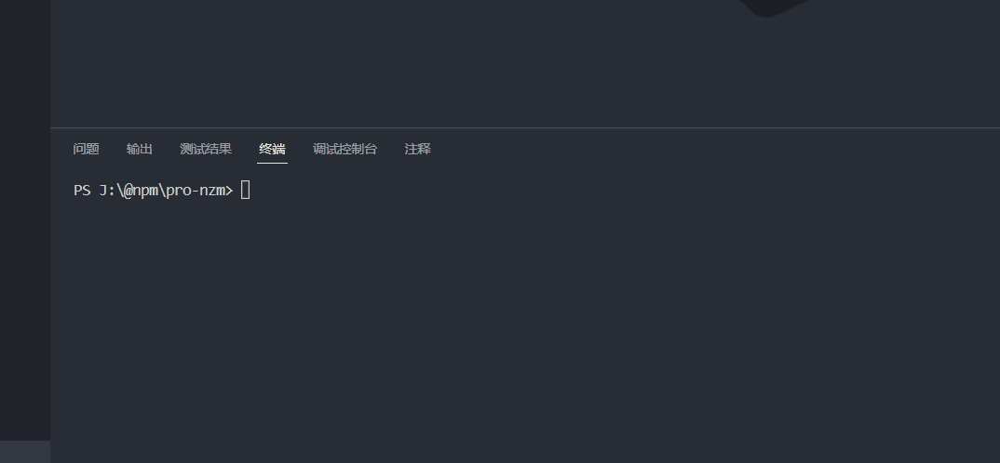
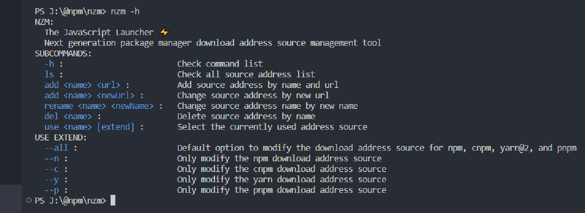
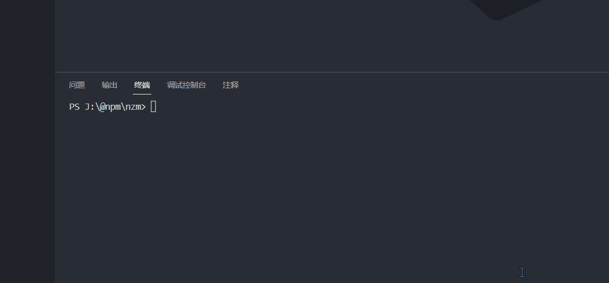
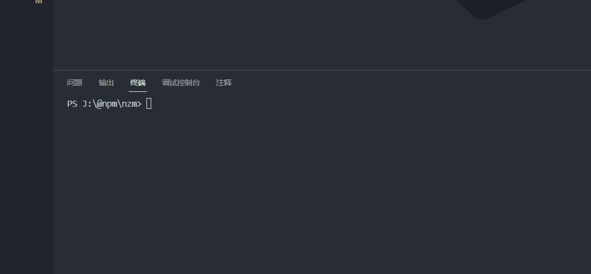
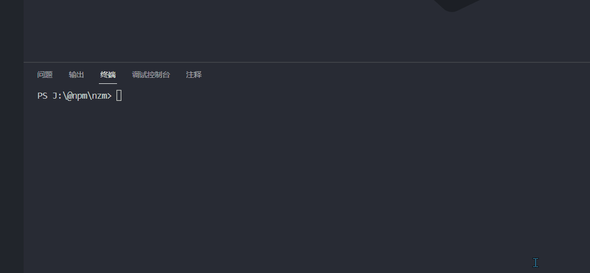

# pro-nzm

[English](./README.md) | 简体中文

## ✨ 介绍

>   **Note**: 这个库的灵感来自于使用 [nrm](https://www.npmjs.com/package/nrm) 时只切换 npm 的问题

**您可以使用此库来帮助npm、cnpm、yarn和pnpm快速切换下载地址源**。此外，你还可以指定单个或多个地址源进行切换。

这个库将为您省去切换地址源的许多麻烦！


## 📦 下载

```bash
npm i -g pro-nzm
cnpm i -g pro-nzm
yarn add -g pro-nzm 
pnpm add -g pro-nzm
```


## 🔨 使用

你可以使用 `nzm add [name] [url]` 去添加你的新的地址源：



你可以使用 `nzm -h` 来查看所有命令列表：



你可以使用 `nzm ls` 来查看所有地址列表：



你可以使用 `nzm use <name>` 来切换下载地址源：

>   默认切换全部，效果与使用`nzm use <name> --all` 相同



你也可以指定包管理器去切换对应的下载地址源，使用  `nzm use <url> [extend]`:




