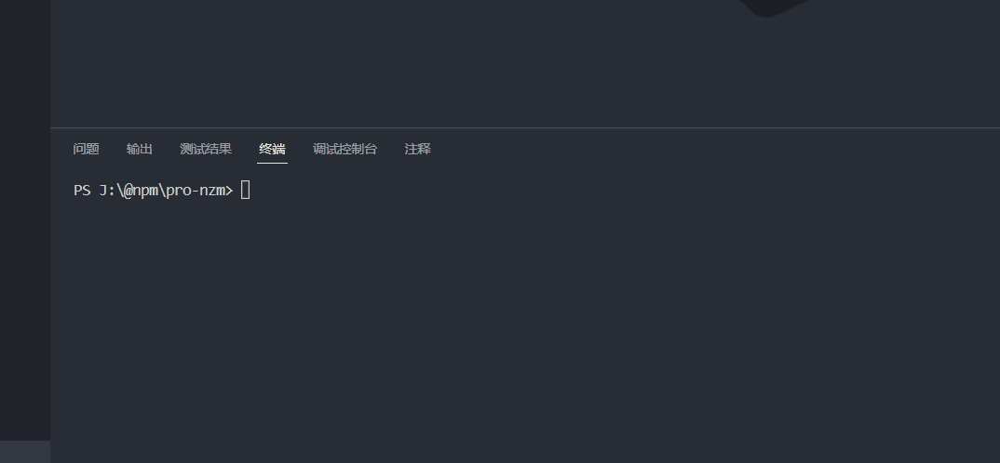
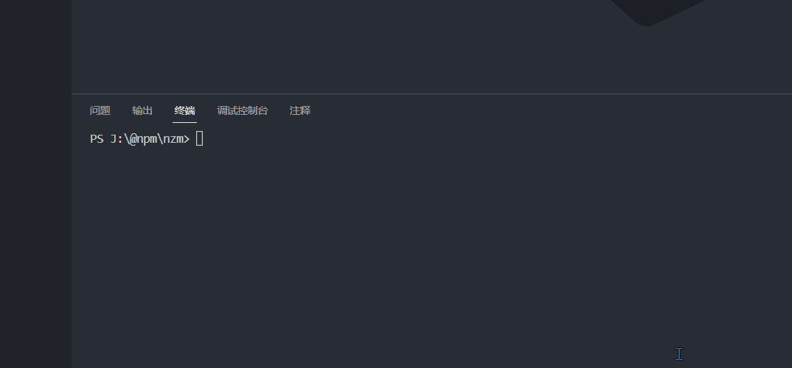
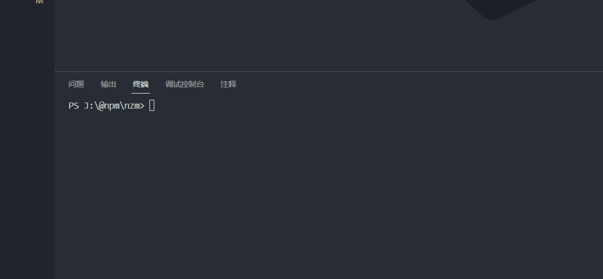
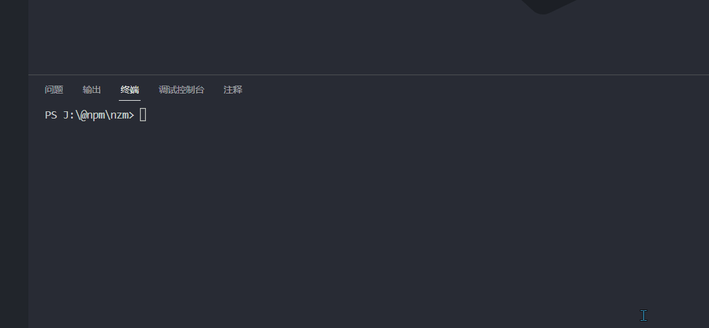

# pro-nzm

English | [简体中文](./README-zh.md)

## ✨ Introduce

> **Note**: The inspiration for this library comes from the problem of only switching npm when using [nrm](https://www.npmjs.com/package/nrm)

**You can use this library to help npm, cnpm, yarn and pnpm quickly switch download address sources**. Also, you can specify single or multiple address sources for switching.

This library will save you a lot of trouble switching address sources!


## 📦 Install

```bash
npm i -g pro-nzm
cnpm i -g pro-nzm
yarn add -g pro-nzm
pnpm add -g pro-nzm
```


## 🔨 Usage

You can use `nzm add [name] [url]` add new address source:



You can use `nzm -h` to check all command list：


You can use `nzm ls` to check all address list：



You can use `nzm use <name>` to switch address source:

> Default Switch All, with the same effect as using `nzm use <name> --all`



You can also specify the packet manager to switch address sources, use `nzm use <url> [extend]`:


